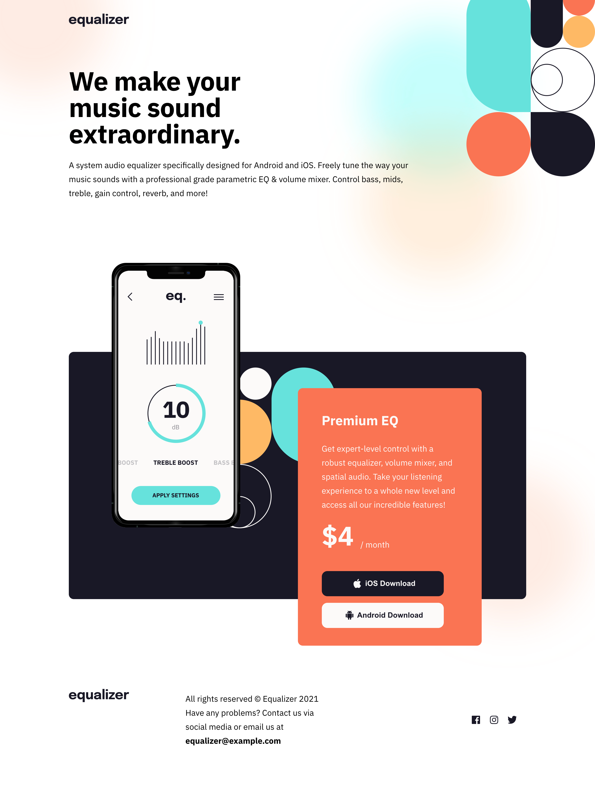

# Frontend Mentor - Equalizer landing page solution

This is a solution to the [Equalizer landing page challenge on Frontend Mentor](https://www.frontendmentor.io/challenges/equalizer-landing-page-7VJ4gp3DE).

## Table of contents

- [Overview](#overview)
  - [The challenge](#the-challenge)
  - [Screenshot](#screenshot)
  - [Links](#links)
- [My process](#my-process)
  - [Built with](#built-with)
  - [What I learned](#what-i-learned)
  - [Continued development](#continued-development)
  - [Useful resources](#useful-resources)
- [Author](#author)
- [Acknowledgments](#acknowledgments)

## Overview

### The challenge

Users should be able to:

- View the optimal layout depending on their device's screen size
- See hover states for interactive elements

### Screenshot



### Links

- Solution URL: [https://github.com/Peteonthebeat/Equalizer-Landing-Page.git]
- Live Demo: [https://peteonthebeat.github.io/Equalizer-Landing-Page/]

## My process

Usually, I laydown the entire HTML first and then begin working on the CSS; I did this project following the same approach. In other cases, I might write the HTML of and stylize each section (one by one)...

### Built with

- Semantic HTML5 markup
- CSS custom properties
- Flexbox
- Mobile-first workflow

### What I learned

I learned about nth selectors, and also practiced positioning background images.

```html
</p>
      <div class="socials">
       <a class="social-link"></a>
        <a class="social-link"></a>
        <a class="social-link"></a>
      </div>
```

```css
.socials {
  display: flex;
  margin: 5em 0;
  .social-link {
    margin: 0 1.5rem 0 0;
  }
  .social-link:nth-of-type(1) {
    background-image: url(/assets/icon-facebook.svg);
    background-size: cover;
    background-position: center;
    height: 20px;
    width: 20px;
  }

  .social-link:nth-of-type(2) {
    background-image: url(/assets/icon-instagram.svg);
    background-size: cover;
    background-position: center;
    height: 20px;
    width: 20px;
  }
  .social-link:nth-of-type(3) {
    background-image: url(/assets/icon-twitter.svg);
    background-size: cover;
    background-position: center;
    height: 20px;
    width: 20px;
  }
  .social-link:hover {
    cursor: pointer;
    transition: 0.5s ease-out;
    filter: invert(62%) sepia(95%) saturate(2590%) hue-rotate(327deg) brightness(
        101%
      ) contrast(96%);
  }
}
```

### Useful resources

https://developer.mozilla.org/en-US/docs/Web/CSS/background-position
CSS background-position property - W3Schools

I also found a bunch of great solutions that helped me figure things out:

https://github.com/sqle157/equalizer-landing-page
https://github.com/stfnpczk/equalizer-landing-page
https://github.com/Anubliss-0/Equalizer-landing-page

## Author

- YouTube - [@potb_tech]
- Frontend Mentor - [@peteonthebeat]
